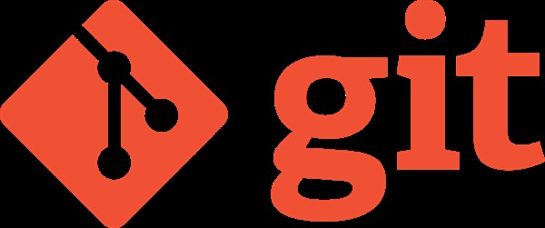

# Raptor Testing Repos 

The purpose of this repo is to try to come up with a git learning template of how to best setup our 2022 code repository

It can be a bit more work, but when done correctly. Can save you.

## Ideas
### Learning git and github
* [what are repos](./what-is-repo.md)
  * Setting up your repo
  * adding files / inital commiting
* [branches](./branches.md)
* pull requests  
* pushing and pulling
* reviews
* workflow
  * How does code get checked into DEV
  * How would it go from DEV --> COMP, is there a review process?  

    For merge to COMP, changes should be reviewed before the PR is merged.  Also maybe setup a task to test build the code so that does pass a build successfuly.

* what am I forgetting>

### More devs
- Creating a system that not only allows, but incurages more then one developer of the code
- devide the robot code up to blocks to incurage more developers working on coding.
### Branches
- Have a dev, and comp/prod branch.   
- All work is done over in dev, but after reviewed and PR'd gets pulled in to Compition

### Documentation
"If it was hard to write, it should be hard to read", - the 70's called, they want their code back.
- How many times has a new season started and the question was asked "What is this?" and "Why did they do it that way?". This is why we need documentation.
- Doesn't have to be complaticated, just a folder in the repo and a bunch of markdown

### Issue Tracking
- Hey if we get a free issue/bug tracker, lets use it.

### Projects
- Same as above.

